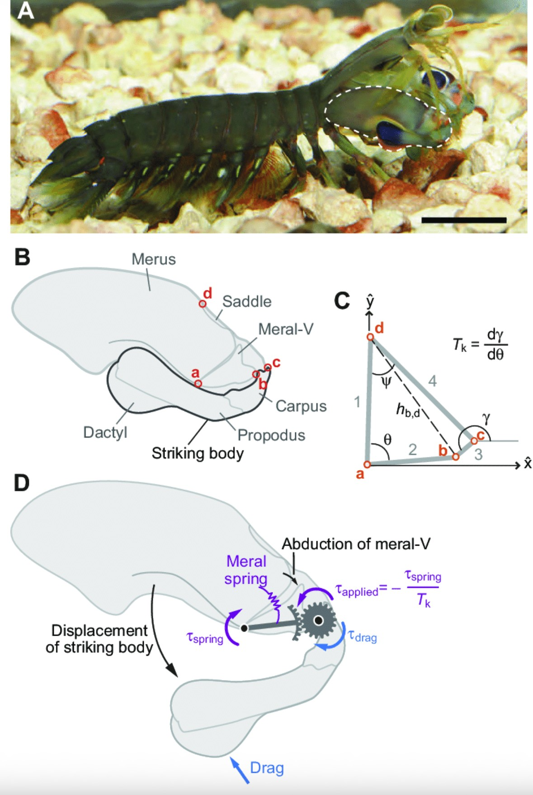
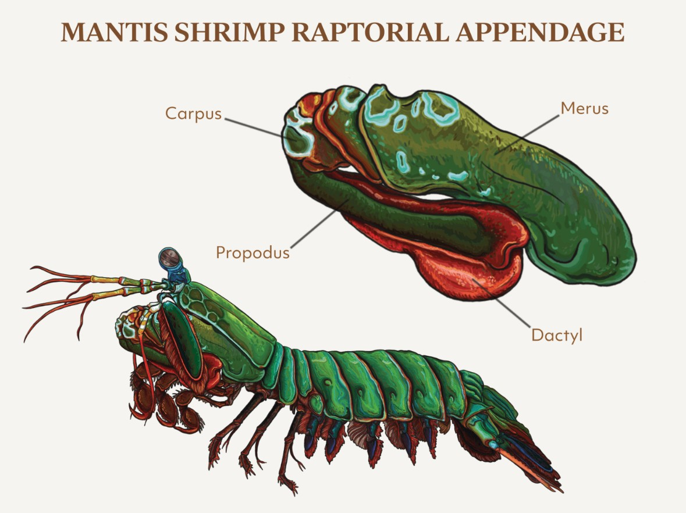
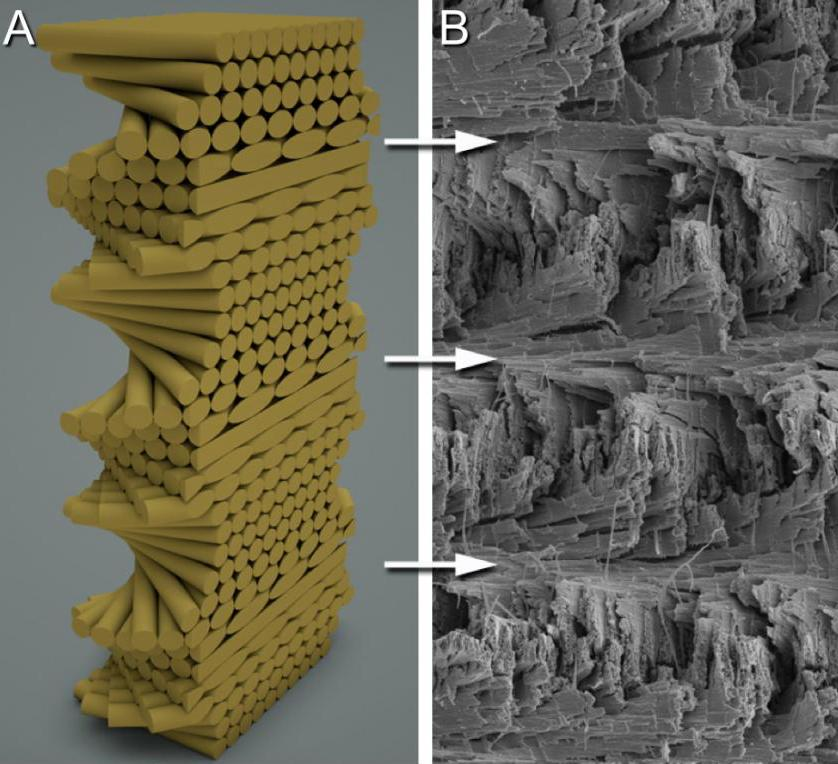

I came across a meme about the striking power of mantis shrimp, which led me down a rabbit hole into their biomechanics. These creatures can accelerate a limb faster than a bullet and generate forces thousands of times their own body weight. This raises two key questions: how do they generate that level of power, and how does their anatomy survive it?

## The Spring–Latch–Mass System

Conventional muscle-driven motion like a human punch is too slow to produce the accelerations observed in mantis shrimp. Instead, they rely on a spring–latch system, similar in principle to a mousetrap or crossbow.

The shrimp slowly contracts its flexor muscles, compressing a structure known as the *saddle*. This acts as a biological spring, storing elastic potential energy. A latch mechanism holds this system in a loaded state. When a target is acquired, a small trigger muscle releases the latch, transferring the stored energy almost instantaneously into the **dactyl club** (the striking appendage).

This mechanism allows the club to reach accelerations on the order of **10,000g**, making it one of the fastest known appendage movements in the animal kingdom.

## Impact + Cavitation = Dual Strike

As the dactyl club moves through water at extreme speed, it generates a **low-pressure region** in its wake. This causes the surrounding water to vaporize into bubbles, a process known as cavitation.

When these bubbles collapse milliseconds later, they produce a secondary **shockwave** that can be nearly as powerful as the initial impact. In effect, the target is struck twice: once by the club itself, and again by the cavitation collapse.

Cavitation is also responsible for erosion in marine propellers, highlighting just how destructive this effect can be. There’s a [useful animation of the process here](https://asknature.org/strategy/appendage-creates-tremendous-forces/).

## Absorbing the Impact

This leads to a more interesting engineering problem: how does the dactyl club survive repeated high-energy impacts without catastrophic failure?

The outer layer of the club is composed of hydroxyapatite, a hard mineral also found in human bone. But, the internal structure is where things become particularly interesting.

The interior consists of a helicoidal (spiral) arrangement of mineralized fibers. Between these layers are softer phases composed of chitin and protein. This layered composite structure serves two key functions:

- **Energy dissipation** through controlled deformation  
- **Crack deflection**, preventing fractures from propagating along a single plane  

The result is a material that combines high stiffness with exceptional toughness—properties that are typically difficult to achieve simultaneously.

This architecture closely resembles the nacre (mother-of-pearl) structures I explored in [previous work](https://ilhanesmail.com/blog/posts/bio-ceramics), where layered composites achieve similar resistance to fracture.

## Engineering Implications

The helicoidal architecture of the mantis shrimp club has attracted interest for applications in helmets, body armor, and aerospace impact structures. However, manufacturing such geometries at scale remains a major constraint.

Most traditional processes struggle to produce controlled, multi-scale fiber orientations. This is where additive manufacturing becomes relevant. With sufficient control over toolpaths and material deposition, it may be possible to approximate these biological structures.

There is a clear opportunity to explore bio-inspired infill strategies that mimic helicoidal layering. Its worth programming a helicoidal infill prototype to see if it can improve impact resistance in printed parts. I may do this in future work.